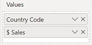
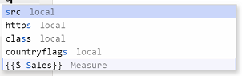
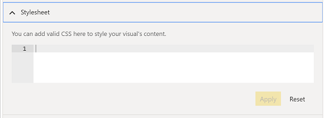
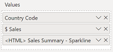

# Advanced Editing

---
[Home](../README.md) | [Release Notes](./release_notes.md) | [Usage](./usage.md) | **Advanced Editing** | [Privacy Policy](./privacy_policy.md)

---

>*Advanced Editing is a feature  introduced in version 2.0 of the visual, so if you're using the current marketplace version, then you'll need to continue to use the [standard functionality](./usage.md) until this gets submitted and approved.*

Advanced Editing is an alternate means to the conventional approach of writing HTML-in-DAX and aims to provide a mechanism for producing content that is simpler in-essence, but provides much more flexbility for power users.

## Getting Started

Let's start with the same data as on our [Usage](./usage.md) page:


Again, the `[Country]` and `[Country Code]` columns are fields from our data model and `[$ Sales]` is a simple `SUM()` measure that calculates total sales for the current row context.

This time, we will use the Advanced Editing functionality to produce our generated HTML rather than DAX.

### Country Flag

Instead, we'll drag the `[Country Code]` column into the **Values** data role as-is, e.g.:


Not very exciting... but we'll change that. Let's open the Advanced Editor in the visual header's **Edit** function:


This will put the visual into focus mode, with a UI surrounding the visual, e.g.:


* The left-hand menu provides functionality to amend aspects of the visual's generated HTML content, with options for:

    * Data Row HTML Template
    * Body HTML Template
    * Stylesheet

* The right-hand menu shows your visual's output.

Previously, we generated an `` element for our flag using DAX, but we can now do this on a per-row basis. Let's open the **Data Row HTML Template** menu:


This is the default data row template - the `{{row}}` placeholder is there to indicate where the fields and measures added to the **Values** data role will be placed. Right now, this is taking the `[Country Code]` value for each row and displaying it within a `<div>` element. If another column or measure were added, this would be placed adjacent to the previous value.

Rather than pass-through the data, we can modify the HTML template and inject columns or measures by surrounding their display name with double-braces - `{{ }}`. This allows us to specify exactly where we should position the row values in our HTML, and even multiple times in the same row.

We can update our template as follows:

```html
<div class="htmlContentDataRow">
  
</div>
```

When we click the **Apply** button, the visual will update as follows:


### Adding $ Sales

With the Advanced Editor still open, we can drag in the `[$ Sales]` measure to the **Values** data role. 



As we removed the `{{row}}` placeholder, this will not be displayed, but the measure gets added to the editor's auto-completion, e.g.:



We can then position this how we like - as per the example in the standard usage page, we'll make this bold, and our template now looks as follows:

```html
<div class="htmlContentDataRow">
   <b>{{$ Sales}}</b>
</div>
```

After clicking **Apply**, our visual updates as follows:


Note that if the measure has a format applied to it, the visual will apply this also.

### Body Content

The **Body HTML Template** allows us to customise the HTML surrounding the data, which is great if we want to decorate this within the visual. If we expand this menu, we can see the standard template, e.g.:


The `{{dataset}}` placeholder is where the visual's data (represented by the Data Row HTML Template) will be added to the generated content.

For example, we could write a lead-in to the visual's data by updating the template as follows:

```html
<div class="htmlContentBody">
  <h3>Sales Breakdown</h3>
  <p>For the selected reporting period, total sales are as follows:</p>
  {{dataset}}
  <hr/>
  <small><b>Disclaimer</b>: sales data is as at the end of the previous full-day's trading.</small>
</div>
```

After clicking **Apply**, our visual updates as follows:


### Stylesheet

The **Stylesheet** allows us to write CSS that we can apply to our visual. We can expand the menu and see the default template (which is currently empty), e.g.:



We'll update our disclaimer (which uses a `<small>` element) to be a little more subtle, e..g.:

```css
small {
  font-size: 0.9em;
  font-style: italic;
  color: grey;
}
```

After clicking **Apply**, our visual updates as follows:


### Mixing HTML-in-DAX

You can also combine the approach used in [standard functionality](./usage.md) to embed columns or measures containing HTML.

For example, while we can do the [sparkline example](./usage.md#sparklines) using Advanced Editing, we could simplfy the SVG generation part into its own measure:

```
<HTML> Sales Summary - Sparkline = 

    // Define the measures we need for calculations

        // Our dates
            VAR XMinDate = MIN('Financials'[Date])
            VAR XMaxDate = MAX('Financials'[Date])
            
        // Obtain overall min and overall max measure values when evaluated for each date
            VAR YMinValue = MINX(VALUES('Financials'[Date]),CALCULATE([$ Sales]))
            VAR YMaxValue = MAXX(VALUES('Financials'[Date]),CALCULATE([$ Sales]))
    
    // Attributes that we want to make easier to modify later
            
        // Intended width of my visual
            VAR VisualWidth = 350

        // Intended dimensions of SVG view box
            VAR ViewboxWidth = VisualWidth * 0.5
            VAR ViewboxHeight = 20
            VAR SparklineScaleFactor = 0.9

        // Sparkline attributes - we could potentially drive these through measures also
            VAR SparklineHeight = ViewboxHeight * SparklineScaleFactor
            VAR SparklineWidth = ViewboxWidth * SparklineScaleFactor
            VAR SparklineStrokeWidth = 2
            VAR SparklineColour = "#12239E"
            
    // Sparkline calculations WRT attributes

        // Build table of X & Y coordinates and fit to viewbox
            VAR SparklineTable = ADDCOLUMNS(
                SUMMARIZE(
                    'Financials',
                    'Financials'[Date]
                ),
                "X", INT(SparklineWidth * DIVIDE('Financials'[Date] - XMinDate, XMaxDate - XMinDate)),
                "Y", INT(SparklineHeight * DIVIDE([$ Sales] - YMinValue,YMaxValue - YMinValue))
            )

    // Concatenate X & Y coordinates to build the sparkline
        VAR Lines = CONCATENATEX(SparklineTable, [X] & "," & SparklineHeight - [Y], " ", [Date])
    // SVG for sparkline
        VAR Sparkline = "<svg style='height:" & ViewboxHeight & "px; width:" & ViewboxWidth & "px'>
            <g transform='translate(" 
                    // Adjust X/Y for padding
                        & DIVIDE(ViewboxWidth - SparklineWidth, 2) & ", " 
                        & DIVIDE(ViewboxHeight - SparklineHeight, 2) & ")'>
                <polyline fill='none' stroke='" 
                    & SparklineColour & "' stroke-width='"
                    & SparklineStrokeWidth & "' points='" 
                    & Lines 
                    & "'/>
            </g>
        </svg>"
                
    RETURN
        Sparkline
```

We could then add this to the **Values** data role:



We can then refer to this in the normal way and add this to our Data Row HTML Template, e.g.:

```html
<div class="htmlContentDataRow">
   <b>{{$ Sales}}</b> {{<HTML> Sales Summary - Sparkline}}
</div>
```

After clicking **Apply**, our visual updates as follows:


## Advanced Editor Options

There is an **Advanced Editor Options** menu in the properties pane that allows you to modify some behaviour of the UI and embedded editors.

* **Sidebar Width (%)** allows you to increase or decrease the proportion of the width that the Advanced Editor sidebar takes up. This is currently capped between **15%** and **60%**.
* **Tab Size** allows you to change the amount of space used whenever you use the [Tab] key in the editor.
* **Wrap Text** lets you determine whether the editors will wrap text when the horizontal limit is reached, or it should remain on a single line and the editor scroll horizontally.

## Next Steps & Important Things to Note

By this point, you should have a reasonable intro to the concepts around Advanced Editing. Before you get too ambitious, we are hamstrung by some of the limitations of hosting content insisde a custom visual.

Because custom visuals are already hosted inside a `sandbox`ed `<iframe>`, we cannot do something similar with the generated HTML content to safely sandbox it as this is not permitted. As such, there are some things to bear in mind if you want to get super-creative.

### Generated HTML 'DOM'

* Generated HTML is placed inside a `<div>` with ID `renderedHtmlOutput`.
* Although the Body HTML Template uses a `<div>` as a container by default, this can be changed to whatever you like to make your content work, providing that the HTML produces valid output and fits within the constraints imposed upon custom visuals by Power BI. 
* Similarly, while the Data Row HTML Template also uses a hosting `<div>` element, this can also be modified.

For example, you could create a `<table>` with a `<thead>` and `<th>` for column headings in the Body HTML Template and then create a Data Row HTML Template with `<tr>` and `<td>` elements in the appropriate places:


##### Body HTML Template

```html
<h3>Sales Breakdown</h3>
<p>For the selected reporting period, total sales are as follows:</p>
<table>
  <thead>
    <th>
      Country
    </th>
    <th>
      Total Sales
    </th>
    <th>
      By Month
    </th>
  </thead>
  <tbody>
    {{dataset}}
  </tbody>
</table>
<hr/>
<small><b>Disclaimer</b>: sales data is as at the end of the previous full-day's trading.</small>
```

##### Data Row HTML Template

```html
<tr>
  <td>
     {{Country}}
  </td>
  <td>{{$ Sales}}</td>
  <td>{{<HTML> Sales Summary - Sparkline}}</td>
</tr>
```

##### Stylesheet

```css
small {
  font-size: 0.9em;
  font-style: italic;
  color: grey;
}
table {
  border-spacing: 0;
  border-collapse: separate;
}
td, th {
  padding: 5px;
}
th {
  background: #eeeeee;
}
```

### Generated Stylesheet

In order to preserve the behaviour of the Advanced Editor UI and visual workflow, any CSS you enter into the Stylesheet will be namespaced into the main `<div>` element. For the example above, this gets compiled as follows:

```css
#renderedHtmlOutput small {
    font-size: 0.9em;
    font-style: italic;
    color: grey;
}

#renderedHtmlOutput table {
    border-spacing: 0;
    border-collapse: separate;
}

#renderedHtmlOutput td,
#renderedHtmlOutput th {
    padding: 5px;
}

#renderedHtmlOutput th {
    background: #eeeeee;
}
```
When opting to **Show Raw HTML** under **Content Formatting** in the properties pane, the generated CSS is also displayed in a `<style>` tag, with this namespacing.


